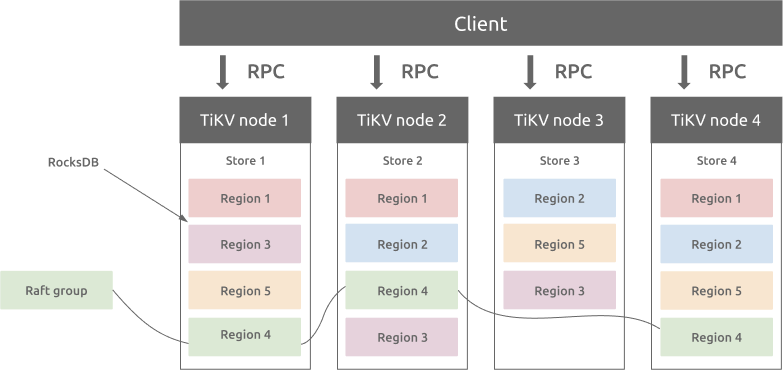
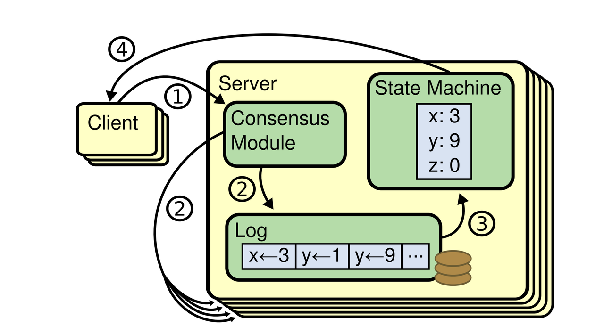
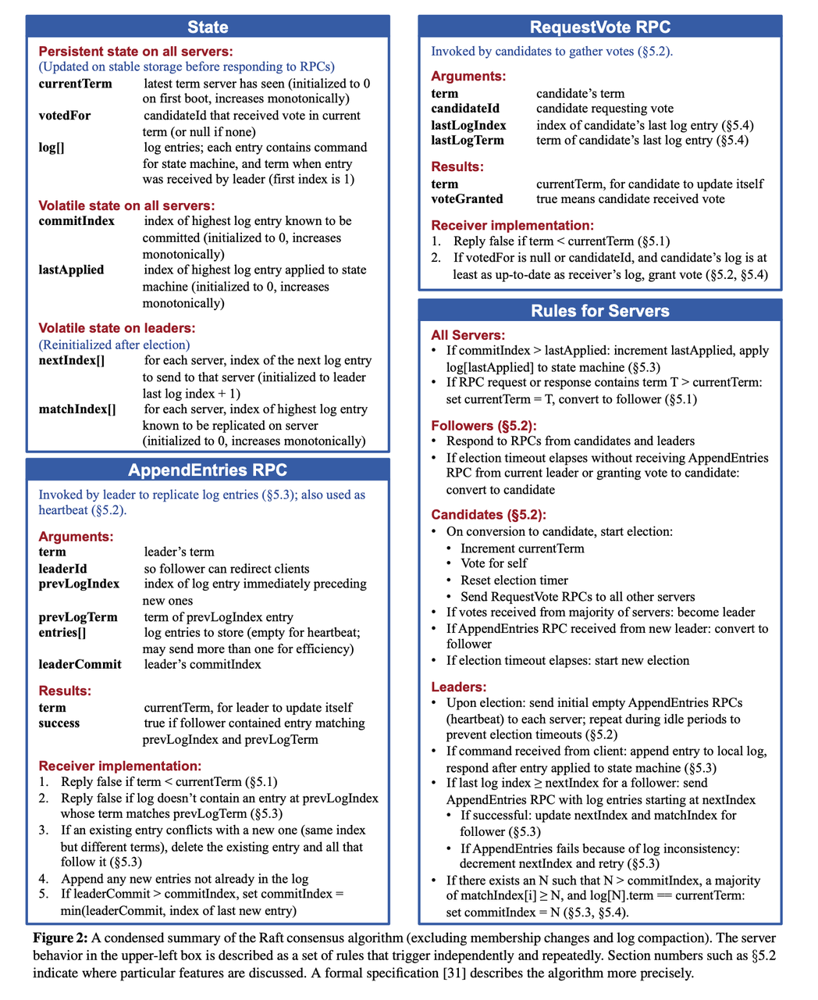

在学习本节之前，最好先自己看一遍 [Raft Paper](https://raft.github.io/raft.pdf)。如果英语不好，可以在网上搜翻译版来看。

# 使用场景

Raft 本质上是一种**共识算法**（consensus algorithm）。为什么要使用共识算法呢？什么场景下要使用共识算法呢？为什么共识算法逐渐成为了分布式系统的基石呢？

让我们来试着理一下内在逻辑：随着数字化的发展，当数据集（比如数据库中的一个 table）随着业务的增长，膨胀到一定地步之后，单机不再能存得下。因此需要将该数据集以某种方式切分成多个**分片**（Shard，也有地方称为 Partition、Region 等等）。分片之后，就可以将单个数据集分散到多个机器上。但是随着集群使用的机器数增多，整个集群范围内，**单个机器的故障**（各种软硬件、运维故障）概率就会增大。为了容忍机器故障、保证每个分片时时可用（可用性），我们通常会将分片**冗余多份**存在多个机器上，每个冗余称为一个**副本**（replication）。但如果分片持续有写入进来，从属于该分片的多个副本，由于机器故障、网络问题，就可能会出现数据不一致的问题。为了保证多副本间的数据一致性，我们引入了**共识算法**。

而我们要实现的 Raft 就是工业界当前一个主流共识算法，另一个是 Paxos。

# 基本原理

Raft 会将**客户端请求**序列化成操作序列，称为**操作日志**（operation log），继而会确保 Raft 的所有**服务器**（Server）会看到相同的日志。其中，每个 **Raft** **Server** 是一个进程，在工程中会各自在独立机器上，但课程中为了方便测试，会将其在单机上使用多线程模拟。Raft Server，也可称为 **Raft Instance**、**Raft Peer**，都是说的一个概念。

在工程实践中，通常一个 Raft Server 会包含多个数据分片的**状态机**（对应上文说的数据分片的一个副本），不同机器上从属于一个数据分片的副本联合起来组成一个 Raft Group，这样一个集群中就会存在多个 Raft Group。如 TiKV 的架构（他们的数据分片叫 Region）：

但在本课程 Raft 部分中，我们只考虑最简单情况：一个 Raft Server 中只包含一个状态机。在后面 ShardKV 部分中，会扩展到类似 TiKV 的架构。

所有 Raft Server 初始状态为空，然后回按照按相同的顺序执行相同的客户端请求，进而保证状态机是一致的。如果某个 Raft Server 宕机重启后，进度落下了，Raft 算法会负责将其日志进行追平。只要有**超过半数**的 Peer 存活并且可以互相通信，Raft 就可以继续正常运行。如果当前没有多数派存活，则 Raft 将会陷入停滞，不能继续接受客户端来的请求。不过，一旦多数 Peer 重新可以互通，Raft 就又可以继续工作。

这里面涉及几个核心概念角色：

1. **客户端（Client）**：Raft 的客户端，会向 Raft 发送写请求。
2. **服务器（Raft Server，也称为 Raft Instance 或 Raft Peer）**：组成 Raft 集群的单个进程。
3. **状态机（State Machine）**：每个 Raft Server 中会有一个本地的状态机。所谓状态机，在本课程里，可以理解为一个小型的 KV 存储。客户端的读取请求，都会直接打到状态机中。

三者关系可以参照[论文](https://pdos.csail.mit.edu/6.824/papers/raft-extended.pdf)中的图：

图中的四个步骤含义如下：

1. **写入**：**客户端**向 Raft 发送写请求，写入数据
2. **同步**：Raft 模块将请求序列化为日志，然后：
    1. 写入 **Raft Server** 本地 log
    2. 同步到其他 Raft 实例
3. **应用**：每个实例会将 Raft Log 各自应用到**状态机**
4. **读取**：客户端向状态机发送读请求，读取之前写入（状态机中）的数据

其中为什么要以日志作为中间载体来维持一致性呢，可以看看 Kafka 创始人的一篇[文章](https://engineering.linkedin.com/distributed-systems/log-what-every-software-engineer-should-know-about-real-time-datas-unifying)。

# 实现概要

在本课程中，我们将使用 Go 来实现 Raft —— 将每个 Raft 实例组织为一个 Go 的 struct，每个 Raft 实例在逻辑上会维护一个无限的**操作序列**（commands sequence），每个**操作**都有下标（从 1 开始的自增下标）。该下标类似于 TCP 中的序号，是我们在多机对操作序列达成共识的重要设计。每个操作也称为**日志条目**（log entry），一旦日志条目在多机达成共识，我们就可以对其进行**提交**（commit）。只有提交之后的日志，才能够被应用（apply）到状态机。

我们之后在进行实现时，要反复研读 [Raft 扩展论文](https://raft.github.io/raft.pdf)，尤其是下面列出的图 2。该图在代码级别定义了我们所需要的数据结构和每个 RPC 的行为细节。论文中提到的大部分功能我们都会实现：领导选举、日志同步、宕机恢复、日志压缩。

**配置变更**（config changes）是指 Raft 中 Server 个数动态的增删，通常用于**多个** Raft Group 的分裂和合并（通常用于 Partition 的分裂与合并），因此实现了配置变更的 Raft 通常也称为 Multi-Raft。此部分较为复杂，我们本课程中不做实现。

在铺垫了基本概念之后，接下来我们来梳理下 Raft 算法细节。

相比 Paxos，Raft 的一大特色就是算法拆成了相对正交的几个部分——领导者选举、日志同步、状态持久化、日志压缩和配置变更。你如果对课程照目录看下就能看出来，除却最后一部分，这些模块就是我们课程 PartA ~ PartD 要分别实现的内容。将算法正交化拆分的好处是，让每个模块相对内聚，使得整体更易理解和实现——这也是 Raft 算法设计的初衷。

下面我不打算采用**精确**的方式来讲解每个模块——那是**论文正文**和**代码实现**要做的事情。相反，本章我将带领大家在**感性**上建立一个对 Raft 基本概念（任期、选举）和两大流程（领导选举、日志同步）的认识。带着这个感性认识，大家可以再去仔细研读[论文](https://raft.github.io/raft.pdf)，想必能事半功倍地梳理出 Raft 算法中海量的细节。

# 任期

**任期**（term）在任何共识协议中都很重要。Raft 中所有关键事件的展开，都是基于任期的，任期最直观的理解就是领导者任期，如“总统任期”。

但其本质上是一种关于时间隐喻，可以理解为“纪元”——如桃花源中的村民“不知有汉，无论魏晋”的那种朝代纪元。与桃花源村民相似，在 Raft 中，如果出现网络分区，某些 Peer 被隔绝，也很容易不知道其他 Peer 到了哪个 Term。一段时间后，被隔绝分区中的 Peer 与其他 Peer 重新建立通信（武陵人发现了他们）时，首先要做的就是对齐 Term，这是之后一切沟通展开的基础。

从另外一个角度讲，任期还是一种**优先级**或者**权力**的隐喻：

1. 低任期的 Peer 收到高任期的 Peer 任何信息后，会自动“跟上”（Follow）任期变成**跟随者**（Follower）。
2. 高任期的 Peer 收到低任期 Peer 的任何**请求**时，会直接拒绝。

在所有 Peer 进行“交流”（RPC 通信）时，任期都是第一优先级的，只有对齐了任期，才有谈其他的基础。

# 领导选举

Raft 使用的是“强人模式”，即只要 Leader 当选，他就对其任期内日志长啥样有说一不二的权力。Raft 中也采取“一山不容二虎”策略——一个任期内最多有一个 Leader（也可以没有选出）。但在同一时刻，可能会存在多个 Leader，但，他们一定处于不同任期中。

由于采用强人策略，则在选举时就要慎之又慎——以期能选出能“顾全大局”的人（具备所有已提交日志的候选者）。为此，每个 Peer 在投票时，都要比比谁的日志“更新更全”。一旦跟随者投出其票，就表示对该候选者心悦诚服——“承诺”一段时间内不会再发起选举（重置选举时钟）。

Leader 在当选后，要做的第一件事就是“昭告天下”（心跳）以“压制”其他“试图挑战权威”的人——“迫使”每个 Follower 承诺一段时间内不得再发起选举。Follower 在收到心跳后，只要任期不比人家大，就要乖乖给出“承诺”（重置选举时钟）。

之后，Leader 便会周期性的发送“政令”，直到收到来自高“任期”的消息，便要乖乖“交权”，让出领导权。从这里也可以看出，任期是第一优先级，这是“时间法则”的攻击，Leader 也不能免疫。当然，还有一种优化，就是 Leader 发现自己成为“孤家寡人”（发现大部分人不应答“政令”了，通常出现在 Leader 与多数 Follower 发生了网络隔离时）后，也自动交权。

# 日志同步

Leader 在接收到“甲方”（客户端）的“请求”后，会将其包装为“政令”（日志），然后“附带”到周期性的广播（心跳）上，将“政令灌输”给每个 Follower。最简单粗暴的方式，就是将本地所有日志一股脑的附带到心跳上，Follower 收到后，直接替换本地日志即可。但如果 Leader 日志量很大，通信代价将会非常高。因此 Leader 采用一种“乐观+回撤”的方式进行同步：

1. **乐观**：一开始心跳不附带任何日志，只带一些“暗号”过去。假如 Follower 的通过“暗号”发现自己日志跟 Leader 完全一致，就直接回：一致，之后的心跳不需附加任何日志。
2. **回撤**：如果 Follower 通过“暗号”发现自己和 Leader 日志并不一致，也会告诉 Leader——下次得附带日志。则 Leader 就附加一些末尾的日志，如果发现还是不一致，就要继续回撤，多向前附加一些日志，同时更新“暗号”，直到收到 Follower 肯定回复，则继续恢复不附加任何日志的心跳。

这个“暗号”，就是 Leader 所附带日志的的前一条日志信息的二元组：`<下标，任期>`。如果心跳没有附加任何日志，则暗号就是 Leader 最后一条日志的相关信息。为了保证 Leader 附带日志总有前一条日志，我们在对日志进行初始化的时候，会在开头放一条“空日志”，从而避免一些边界判断（这个做法类似带头结点的链表）。

那为什么只要“暗号”对的上，就能保证两方日志前缀一致呢？

简单来说，对“暗号”的过程，就是一个**递推**的过程。根据**数学归纳法**，每次附加新日志，都要对齐前序日志。而由任期单调递增、单任期最多一个 Leader，则同任期的日志前缀一定对得上。这样一来，同任期前缀对的上，跨任期同步前都会对齐前任日志，则“政令畅通”的情况下，所有日志最终都会收敛为 Leader 日志。

在“政令”（日志）同步到大多数节点后，Leader 就会宣布该政令“生效”（提交）。但论文特别强调了，Leader 不能直接宣布前任的“政令”生效，而要在本任期内发布“政令”后，通过“生效”本任期“政令”来间接“追认”前序任期的相关“政令”。这是为什么呢？（下图是 Raft 中大名鼎鼎的一张图“Figure 8”，很多实现 Raft 的同学应该都被该图虐过。）

这是由于我们选举时会通过比最后一条日志的“大小”来决定是否 Leader 当选，因此前任的日志，如果没有通过本任期“盖棺定论”，是有可能被其他在相同下标具有更新日志的 Peer 当选 Leader 后“冲掉的”，也就是上图 c、d、e 的情况——没有 4 日志的“压一道”， S5 是可以当选 Leader 的，之后 S1~S3 的 2 日志是有可能被 S5 的 3 的日志冲掉。

> 注意：这个图中 d 和 e 的结果是互斥的。其意思是如果我们在 c 中提交 2 是不对的，因为可能发生 d 中 2 被冲掉的情况；但是我们在 e 中通过提交 4 间接提交 2 就没有问题；

# 继续观看

这里罗列了一些重要的参考资料，包括课程讲义中列出的、课程助教的博客和网上一些同学的分享记录等等。

1. 作者讲解：https://www.youtube.com/watch?v=YbZ3zDzDnrw
2. 论文原文：[In Search of an Understandable Consensus Algorithm (Extended Version)](https://raft.github.io/raft.pdf)
3. 可视化 1：http://thesecretlivesofdata.com/raft/
4. 可视化 2：https://observablehq.com/@stwind/raft-consensus-simulator
5. Raft Structure Advice：https://pdos.csail.mit.edu/6.824/labs/raft-structure.txt
6. Debugging by Pretty Printing：https://blog.josejg.com/debugging-pretty/
7. Students' Guide to Raft ：https://thesquareplanet.com/blog/students-guide-to-raft/
8. An Introduction to Distributed Systems**：**https://github.com/aphyr/distsys-class