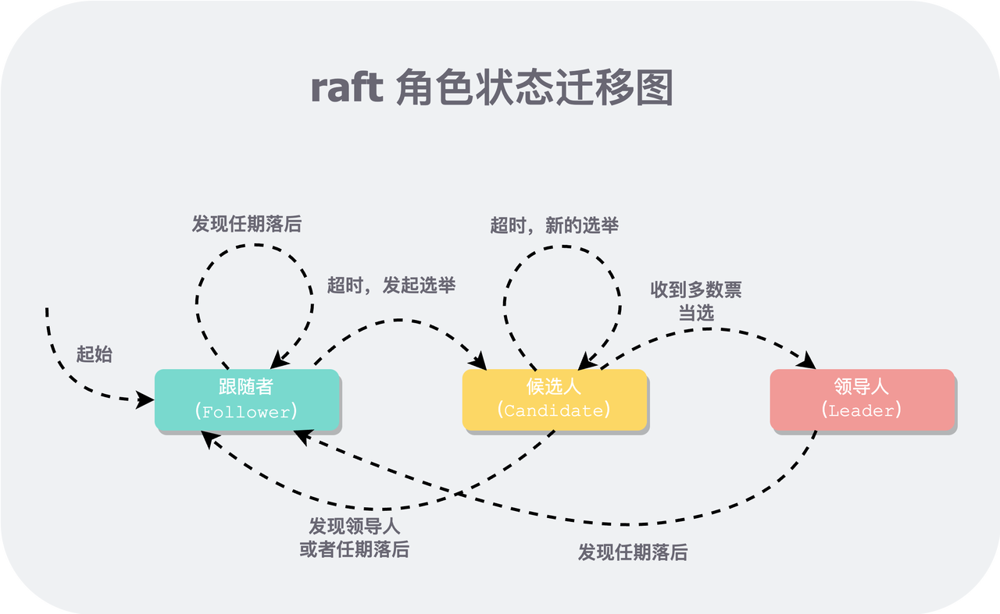

# 实现概要

该实验虽然功能最简单，但作为第一个实验，需要熟悉环境上手、构建整体代码框架(Raft 代码总览)、掌握用锁技巧(附录1)、掌握打日志方法和调试技术(附录2)，因此需要花费的精力却可能最多。

本节主要实现**不带日志**的选主逻辑。对于两个主要逻辑来说：

1. `AppendEntries` RPC 请求只负责通过心跳压制其他 Peer 发起选举，心跳中**不包含**日志数据。
2. `RequestVote` RPC 请求中只会比较 term，会跳过谁的日志更 up-to-date 的比较。

在学习完`代码框架(02.Raft 代码总览)`一章感受了基本代码框架之后，我们可以将 PartA 的实现分为三部分：

1. **状态转换**：角色定义和三个状态转换函数
2. **选举逻辑**：定义选举 RPC 相关结构体，构造周期性发送请求的 Loop
3. **心跳逻辑**：定义心跳 RPC 相关结构体（只有心跳，因此不涉及日志），当选 Leader 后发送心跳

在开始实现逻辑之前，要根据[论文图 2]定义 Raft 用到的基本数据结构，如前所述，PartA 暂时不用管日志相关字段和逻辑。下面代码中，上面部分是代码框架为了测试默认给的，加粗部分是本部分新加的。

```Go
// A Go object implementing a single Raft peer.
type Raft struct {
        mu        sync.Mutex          // Lock to protect shared access to this peer's state
        peers     []*labrpc.ClientEnd // RPC end points of all peers
        persister *Persister          // Object to hold this peer's persisted state
        me        int                 // this peer's index into peers[]
        dead      int32               // set by Kill()

        
        // Your data here (PartA, PartB, PartC).
        // Look at the paper's Figure 2 for a description of what
        // state a Raft server must maintain.
        role        Role
        currentTerm int
        votedFor     int

        // used for election loop
        electionStart   time.Time
        electionTimeout time.Duration
}
```

**注**：在工程实践中，`currentTerm` 一般会建议用指定位数的整形，比如 `int32`，但这里为了简单就直接用 `int` 了。

修改关键函数 `GetState`，是测试框架能够正确拿到 Raft 相关状态，否则可能会出现测试框架认为一直选不出主的情况：

```Go
// return currentTerm and whether this server
// believes it is the leader.
func (rf *Raft) GetState() (int, bool) {
        // Your code here (PartA).
        rf.mu.Lock()
        defer rf.mu.Unlock()
        return rf.currentTerm, rf.role == Leader
}
```

# 状态转换

状态转换是针对 Peer 角色的，因此需要先定义**角色类型**和**常量**：

```Go
type Role string

const (
        Follower  Role = "Follower"
        Candidate Role = "Candidate"
        Leader    Role = "Leader"
)
```

在此之上，参考论文中的状态机构建状态转换函数。



可以实现为三个状态转换函数：`becomeCandidate`，`becomeLeader` 和 `becomeFollower`。由于涉及修改 Raft 的全局状态，需要加锁，且我们期望在函数外边加锁。按照之前提到的[命名规则](https://av6huf2e1k.feishu.cn/docx/EGLad8DZ0olT50xZQOdcZhEgnvg#GzH1d5k72oP0BXxQmWjc1ESQnib)，对每个函数需要带上 `Locked` 后缀，表明需要在加锁的临界区中调用：

```Go
// become a follower in `term`, term could not be decreased
func (rf *Raft) becomeFollowerLocked(term int) {
        if term < rf.currentTerm {
                LOG(rf.me, rf.currentTerm, DError, "Can't become Follower, lower term")
                return
        }

        LOG(rf.me, rf.currentTerm, DLog, "%s -> Follower, For T%d->T%d", 
            rf.role, rf.currentTerm, term)
            
        // important! Could only reset the `votedFor` when term increased
        if term > rf.currentTerm { 
                rf.votedFor = -1
        }
        rf.role = Follower
        rf.currentTerm = term
}

func (rf *Raft) becomeCandidateLocked() {
        if rf.role == Leader {
                LOG(rf.me, rf.currentTerm, DError, "Leader can't become Candidate")
                return
        }

        LOG(rf.me, rf.currentTerm, DVote, "%s -> Candidate, For T%d->T%d", 
            rf.role, rf.currentTerm, rf.currentTerm+1)
        rf.role = Candidate
        rf.currentTerm++
        rf.votedFor = rf.me
}

func (rf *Raft) becomeLeaderLocked() {
        if rf.role != Candidate {
                LOG(rf.me, rf.currentTerm, DLeader, 
                    "%s, Only candidate can become Leader", rf.role)
                return
        }

        LOG(rf.me, rf.currentTerm, DLeader, "%s -> Leader, For T%d", 
            rf.role, rf.currentTerm)
        rf.role = Leader
}
```

可以看出，每个状态转换函数可分为两部分：

1. **状态检查**：检查 Raft 实例当前状态，看是否满足状态转换条件。
2. **状态修改**：修改 Raft 实例角色，更改相应状态。