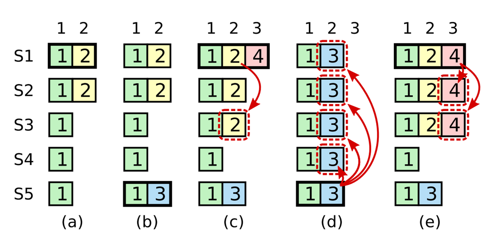

工欲善其事，必先利其器。这次在调试之前，我们首先再加一些之前没有加到位的调试日志。有了这些关键环节的日志，我们就可以追踪日志试探匹配过程中**冲突**以及**后撤**的 index 变迁轨迹和当时 Leader、Follower 两方日志构成。有了这些，即使我们一开始实现出错，也可以根据这些信息来修正我们的优化算法。

# 加些日志

由于大部分时候我们并不需要特别详细的信息，因此我们将这些日志信息大多都加为 Debug 级别，可以通过设置 `VERBOSE = 0` 来打印，`VERBOSE = 1 ` 来关闭对 Debug 日志的打印。

## RPC 收发信息

每个 RPC 发送出去、收到的时候，都可以打印下关键参数信息。为了复用，我们可以给 RPC 用到的 XXXArgs 各自构造一个 format 好的 `String()` 函数。且尽量的简洁的打印信息。

领导选举模块收发信息：

```Go
func (args *RequestVoteArgs) String() string {
        return fmt.Sprintf("Candidate-%d T%d, Last:[%d]T%d", args.CandidateId, args.Term, args.LastLogIndex, args.LastLogTerm)
}
func (reply *RequestVoteReply) String() string {
        return fmt.Sprintf("T%d, VoteGranted: %v", reply.Term, reply.VoteGranted)
}

// --- in raft_election.go
func (rf *Raft) RequestVote(args *RequestVoteArgs, reply *RequestVoteReply) {
        // Your code here (PartA, PartB).
        rf.mu.Lock()
        defer rf.mu.Unlock()
        LOG(rf.me, rf.currentTerm, DDebug, "<- S%d, VoteAsked, Args=%v", args.CandidateId, args.String())
        
        // ...... some code omitted
}

func (rf *Raft) startElection(term int) {
        askVoteFromPeer := func(peer int, args *RequestVoteArgs) {
                reply := &RequestVoteReply{}
                ok := rf.sendRequestVote(peer, args, reply)

                // handle the reponse
                rf.mu.Lock()
                defer rf.mu.Unlock()
                if !ok {
                        LOG(rf.me, rf.currentTerm, DDebug, "-> S%d, Ask vote, Lost or error", peer)
                        return
                }
                LOG(rf.me, rf.currentTerm, DDebug, "-> S%d, AskVote Reply=%v", peer, reply.String())
                // ...... some code omitted
        }
        // ...... some code omitted
        rf.mu.Lock()
        defer rf.mu.Unlock()
        
        // ...... some code omitted
        for peer := 0; peer < len(rf.peers); peer++ {
                if peer == rf.me {
                        votes++
                        continue
                }
                args := &RequestVoteArgs{
                        Term:         rf.currentTerm,
                        CandidateId:  rf.me,
                        LastLogIndex: l - 1,
                        LastLogTerm:  rf.log[l-1].Term,
                }

                LOG(rf.me, rf.currentTerm, DDebug, "-> S%d, AskVote, Args=%v", peer, args.String())
                go askVoteFromPeer(peer, args)
        }
}
```

注：可以看出接收方只打印了 Args 相关信息，这是因为 Reply 信息在已经在各种处理路径中都打印了。

日志复制模块收发信息：

```Go
func (args *AppendEntriesArgs) String() string {
        return fmt.Sprintf("Leader-%d, T%d, Prev:[%d]T%d, (%d, %d], CommitIdx: %d",
                args.LeaderId, args.Term, args.PrevLogIndex, args.PrevLogTerm,
                args.PrevLogIndex, args.PrevLogIndex+len(args.Entries), args.LeaderCommit)
}
func (reply *AppendEntriesReply) String() string {
        return fmt.Sprintf("T%d, Sucess: %v, ConflictTerm: [%d]T%d", reply.Term, reply.Success, reply.ConfilictIndex, reply.ConfilictTerm)
}


// --- in raft_replication.go
func (rf *Raft) AppendEntries(args *AppendEntriesArgs, reply *AppendEntriesReply) {
        rf.mu.Lock()
        defer rf.mu.Unlock()

        LOG(rf.me, rf.currentTerm, DDebug, "<- S%d, Appended, Args=%v", args.LeaderId, args.String())
        reply.Term = rf.currentTerm
        reply.Success = false

        // align the term
        
        // ...... some code omitted
}

func (rf *Raft) startReplication(term int) bool {
        replicateToPeer := func(peer int, args *AppendEntriesArgs) {
                reply := &AppendEntriesReply{}
                ok := rf.sendAppendEntries(peer, args, reply)

                rf.mu.Lock()
                defer rf.mu.Unlock()
                if !ok {
                        LOG(rf.me, rf.currentTerm, DLog, "-> S%d, Lost or crashed", peer)
                        return
                }
                LOG(rf.me, rf.currentTerm, DDebug, "-> S%d, Append, Reply=%v", peer, reply.String())
                // ...... some code omitted
        }
        // ...... some code omitted
        for peer := 0; peer < len(rf.peers); peer++ {
                if peer == rf.me {
                        rf.matchIndex[peer] = len(rf.log) - 1
                        rf.nextIndex[peer] = len(rf.log)
                        continue
                }
                prevIdx := rf.nextIndex[peer] - 1
                prevTerm := rf.log[prevIdx].Term
                args := &AppendEntriesArgs{
                        Term:         rf.currentTerm,
                        LeaderId:     rf.me,
                        PrevLogIndex: prevIdx,
                        PrevLogTerm:  prevTerm,
                        Entries:      rf.log[prevIdx+1:],
                        LeaderCommit: rf.commitIndex,
                }
                LOG(rf.me, rf.currentTerm, DDebug, "-> S%d, Append, %v", peer, args.String())
                go replicateToPeer(peer, args)
        }

        return true
}
```

## 试探阶段信息

包括发送方的**试探信息**（`nextIndex` 轨迹）、接收方的**冲突信息**（`conflictTerm` 和 `conflictIndex` 信息），以及两方当时的 Log 信息。

为了方便复用格式化日志的代码，我们给他封装个函数。我们以 `[startIndex, endIndex]TXX` 形式来按 term 粒度压缩日志信息。也就是简单按 term 归并了下同类项，否则日志信息会过于长，不易阅读。

```Go
// --- in raft.go
func (rf *Raft) logString() string {
        var terms string
        prevTerm := rf.log[0].Term
        prevStart := 0
        for i := 0; i < len(rf.log); i++ {
                if rf.log[i].Term != prevTerm {
                        terms += fmt.Sprintf(" [%d, %d]T%d;", prevStart, i-1, prevTerm)
                        prevTerm = rf.log[i].Term
                        prevStart = i
                }
        }
        terms += fmt.Sprintf(" [%d, %d]T%d;", prevStart, len(rf.log)-1, prevTerm)

        return terms
}
```

发送方试探信息：

```Go
// --- in raft_replication.go
func (rf *Raft) startReplication(term int) bool {
        replicateToPeer := func(peer int, args *AppendEntriesArgs) {
                // ...... some code omitted
               
                // hanle the reply
                // probe the lower index if the prevLog not matched
                if !reply.Success {
                        prevIndex := rf.nextIndex[peer]
                        if reply.ConfilictTerm == InvalidTerm {
                                rf.nextIndex[peer] = reply.ConfilictIndex
                        } else {
                                firstIndex := rf.firstLogFor(reply.ConfilictTerm)
                                if firstIndex != InvalidIndex {
                                        rf.nextIndex[peer] = firstIndex
                                } else {
                                        rf.nextIndex[peer] = reply.ConfilictIndex
                                }
                        }
                        // avoid unordered reply
                        // avoid the late reply move the nextIndex forward again
                        if rf.nextIndex[peer] > prevIndex {
                                rf.nextIndex[peer] = prevIndex
                        }

                        LOG(rf.me, rf.currentTerm, DLog, "-> S%d, Not matched at Prev=[%d]T%d, Try next Prev=[%d]T%d", peer, args.PrevLogIndex, rf.log[args.PrevLogIndex].Term, rf.nextIndex[peer]-1, rf.log[rf.nextIndex[peer]-1].Term)
                        LOG(rf.me, rf.currentTerm, DDebug, "Leader log=%v", rf.logString())
                        return
                }
                
                // ...... some code omitted
        }           

        // ...... some code omitted

        return true
}
```

接收方冲突信息：

```Go
func (rf *Raft) AppendEntries(args *AppendEntriesArgs, reply *AppendEntriesReply) {
        rf.mu.Lock()
        defer rf.mu.Unlock()

        LOG(rf.me, rf.currentTerm, DDebug, "<- S%d, Append, Prev=[%d]T%d, Commit: %d", args.LeaderId, args.PrevLogIndex, args.PrevLogTerm, args.LeaderCommit)
        reply.Term = rf.currentTerm
        reply.Success = false

        // align the term
        if args.Term < rf.currentTerm {
                LOG(rf.me, rf.currentTerm, DLog2, "<- S%d, Reject log, Higher term, T%d<T%d", args.LeaderId, args.Term, rf.currentTerm)
                return
        }
        if args.Term >= rf.currentTerm {
                rf.becomeFollowerLocked(args.Term)
        }

        defer func() {
                rf.resetElectionTimerLocked()
                if !reply.Success {
                        LOG(rf.me, rf.currentTerm, DLog2, "<- S%d, Follower Conflict: [%d]T%d", args.LeaderId, reply.ConfilictIndex, reply.ConfilictTerm)
                        LOG(rf.me, rf.currentTerm, DDebug, "Follower log=%v", rf.logString())
                }
        }()

        // ...... some code omitted
}
```

# 调试

在跑整体测试的时候，发现针对 Figure 8 的测试没有通过：

```Shell
$ go test -run PartC 
Test (PartC): basic persistence ...
  ... Passed --   3.4  3  120   30695    6
Test (PartC): more persistence ...
  ... Passed --  14.3  5 1240  271228   16
Test (PartC): partitioned leader and one follower crash, leader restarts ...
  ... Passed --   1.1  3   44   11285    4
Test (PartC): Figure 8 ...
0: log map[1:7872615498129679323 2:1897413406896793835 3:3934096519556870059 4:5753996391082549933 5:1987667707975356298 6:1523406137084587794 7:3756591963411462759]; server map[1:7872615498129679323 2:1897413406896793835 3:3934096519556870059 4:5753996391082549933 5:1987667707975356298 6:1523406137084587794 7:3756591963411462759 8:4535228716752658303 9:6839402622095127600]
0: log map[1:7872615498129679323 2:1897413406896793835 3:3934096519556870059 4:5753996391082549933 5:1987667707975356298 6:1523406137084587794 7:3756591963411462759]; server map[1:7872615498129679323 2:1897413406896793835 3:3934096519556870059 4:5753996391082549933 5:1987667707975356298 6:1523406137084587794 7:3756591963411462759 8:4535228716752658303 9:6839402622095127600]
0: log map[1:7872615498129679323 2:1897413406896793835 3:3934096519556870059 4:5753996391082549933 5:1987667707975356298 6:1523406137084587794 7:3756591963411462759]; server map[1:7872615498129679323 2:1897413406896793835 3:3934096519556870059 4:5753996391082549933 5:1987667707975356298 6:1523406137084587794 7:3756591963411462759 8:4535228716752658303 9:6839402622095127600]
apply error: commit index=8 server=0 982221549951123211 != server=4 4535228716752658303
exit status 1
FAIL    course/raft     26.008s
```

联系论文中相关配图：



可以想到是一个重要的 bug：Leader 只能提交本 Term 的日志。在 `raft_replicaton.go` 中，将更新 `commitIndex` 的条件改掉就行： 

```Go
func (rf *Raft) startReplication(term int) bool {
        replicateToPeer := func(peer int, args *AppendEntriesArgs) {
                reply := &AppendEntriesReply{}
                ok := rf.sendAppendEntries(peer, args, reply)

                rf.mu.Lock()
                defer rf.mu.Unlock()
                
                // ...... some code ommited

                // update match/next index if log appended successfully
                rf.matchIndex[peer] = args.PrevLogIndex + len(args.Entries) // important
                rf.nextIndex[peer] = rf.matchIndex[peer] + 1

                // update the commitIndex
                majorityMatched := rf.getMajorityIndexLocked()
                if majorityMatched > rf.commitIndex && rf.log[majorityMatched].Term == rf.currentTerm {
                        LOG(rf.me, rf.currentTerm, DApply, "Leader update the commit index %d->%d", rf.commitIndex, majorityMatched)
                        rf.commitIndex = majorityMatched
                        rf.applyCond.Signal()
                }
        }

        
        // ...... some code ommited
        return true
}
```

然后可以发现 race 测试、高并发测试都可以跑过了：

```Shell
➜  raft git:(example) go test -run PartC -race
Test (PartC): basic persistence ...
  ... Passed --   4.9  3  166   44344    7
Test (PartC): more persistence ...
  ... Passed --  14.8  5 1264  277596   16
Test (PartC): partitioned leader and one follower crash, leader restarts ...
  ... Passed --   1.2  3   42   11253    4
Test (PartC): Figure 8 ...
  ... Passed --  36.0  5 1936  406861   44
Test (PartC): unreliable agreement ...
  ... Passed --   4.0  5  233   85774  246
Test (PartC): Figure 8 (unreliable) ...
  ... Passed --  39.3  5 4988 9210073  374
Test (PartC): churn ...
  ... Passed --  16.4  5 1020  988536  545
Test (PartC): unreliable churn ...
  ... Passed --  16.4  5 1527 1984672  228
PASS
ok      course/raft     133.250s
➜  raft git:(example) dstest PartC  -p 30 -n 100
 Verbosity level set to 0
┏━━━━━━━┳━━━━━━━━┳━━━━━━━┳━━━━━━━━━━━━━━━┓
┃ Test       ┃ Failed      ┃ Total      ┃          Time           ┃
┡━━━━━━━╇━━━━━━━━╇━━━━━━━╇━━━━━━━━━━━━━━━┩
│ PartC      │      0      │   100      │      124.70 ± 4.35      │
└───────┴────────┴───────┴───────────────┘
```

# 检查列表

下面给出一些 PartC 可能有问题的检查列表，如果你的代码有问题，但是调了半天没有调出来，可以参考以下信息。

1. 只能提交本 term 日志，不然 `TestFigure8PartC` 过不了。
2. 通过当选的 leader 可以及早 truncate 一些 Follower 的日志，以使之后快速收敛。测试了下似乎差别不大。
3. 优化：收到 Start 就可以发 RPC，不然得等到下一个心跳间隔才能发；但是也不要发太频繁，不然一下 Start 五十个。
4. 注意 `reply.ConflictIndex` 是 `reply.ConflictTerm `的第一项而不是 `args.PrevTerm` 的第一项。