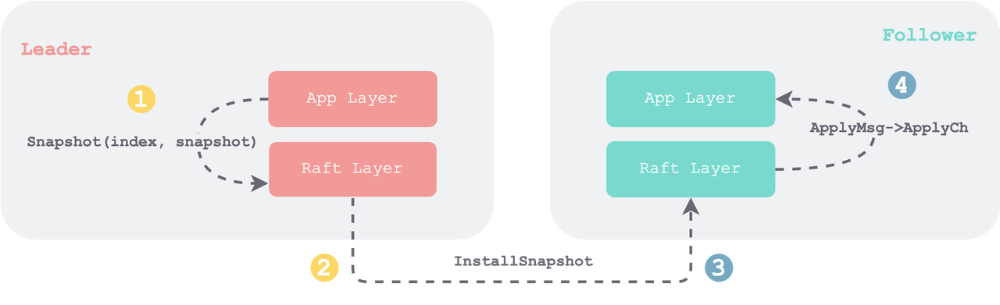

本节我们要实现 `InstallSnapshot` 相关 RPC 。为了避免丢三落四，我们遵循一条 **snapshot 数据流**主线，来分四个步骤，一步步实现：

1. Leader 的应用层调用 `raft.Snapshot(index, snapshot)` 函数
    1. 保存 snapshot
    2. 截断日志
    3. 持久化
2. Leader 在需要时使用该 `snapshot` 构造参数发送 RPC 给 Follower
3. Follower 接收到 Leader RPC 后替换本地日志，并将其持久化
4. Follower 通过 `ApplyMsg` 将 snapshot 传给 Follower 应用层



和之前一样，为了保持模块的内聚性，我们新建一个文件`raft_compaction.go` 将 `Snapshot()` 接口和 `InstallSnapshot` 相关 RPC 都放在一块。

# 调用 `Snapshot()` 接口

Leader 的应用层调用 `Snapshot(index, snapshot)` 接口后，我们会在 `index` 处截断现有日志，将 `snapshot` 保存在 `rf.log` 中，同时将其持久化，以应对可能得宕机重启。

这里需要说明的是，我们将 `RafLog` 中：

1. 应用层（包括 Leader 和 Follower）主动做 snapshot 的接口称为 `RaftLog.doSnapshot`
2. 将 Follower 收到 RPC 后被动做 snapshot 的接口称为：`RaftLog.installSnapshot`

```Go
// --- raft_compaction.go
func (rf *Raft) Snapshot(index int, snapshot []byte) {
        // Your code here (PartD).
        rf.mu.Lock()
        defer rf.mu.Unlock()
        rf.log.doSnapshot(index, snapshot)
        rf.persistLocked()
}
```

在上一节，我们没有对 `snapshot` 字段持久化，本节，我们在 `rf.persistLocked() `接口中，需要对其进行持久化。和其他字段不同，`snapshot` 需要使用 `rf.persister.Save` 接口的第二个参数来持久化。

```Go
// --- raft_persistence.go
func (rf *Raft) persistLocked() {
        w := new(bytes.Buffer)
        e := labgob.NewEncoder(w)
        e.Encode(rf.currentTerm)
        e.Encode(rf.votedFor)
        rf.log.persist(e)
        raftstate := w.Bytes()
        rf.persister.Save(raftstate, rf.log.snapshot)
}
```

# 发送 `InstallSnapshot`

当 Leader 试图给 Follower 同步日志时，如果发现要携带的 `AppendEntriesArgs.Entries` 有部分已经被截断了，则需要先发送 Snapshot 。

这里有个**边界条件**——`AppendEntriesArgs.PrevLogIndex` 等于 `RaftLog.snapLastIdx `时。由于我们上一节在 `RaftLog.snapLastIdx` 处 mock 了一个携带 `snapLastTerm` 的假的日志条目，此条件下并不需要发送 Snapshot。

因此，需要发送 Snapshot 的条件是：**`AppendEntriesArgs.PrevLogIndex < rf.log.snapLastIdx`**  

```Go
// --- raft_replication.go
// only valid in the given `term`
func (rf *Raft) startReplication(term int) bool {
        replicateToPeer := func(peer int, args *AppendEntriesArgs) {
                reply := &AppendEntriesReply{}
                ok := rf.sendAppendEntries(peer, args, reply)

                rf.mu.Lock()
                defer rf.mu.Unlock()
                // --- some codes omitted
                
                // align the term
                // --- some codes omitted

                // check context lost
                // --- some codes omitted

                // hanle the reply
                // probe the lower index if the prevLog not matched
                if !reply.Success {
                        // --- some codes omitted

                        // LogEntry in `nextPrevIdx` may be truncated
                        // so we should check it separately 
                        nextPrevIdx := rf.nextIndex[peer] - 1
                        nextPrevTerm := InvalidTerm
                        if nextPrevIdx >= rf.log.snapLastIdx {
                                nextPrevTerm = rf.log.at(nextPrevIdx).Term
                        }
                        LOG(rf.me, rf.currentTerm, DLog, "-> S%d, Not matched at Prev=[%d]T%d, Try next Prev=[%d]T%d",
                                peer, args.PrevLogIndex, args.PrevLogTerm, nextPrevIdx, nextPrevTerm)
                        LOG(rf.me, rf.currentTerm, DDebug, "-> S%d, Leader log=%v", peer, rf.log.String())
                        return
                }

                // update match/next index if log appended successfully
                rf.matchIndex[peer] = args.PrevLogIndex + len(args.Entries) // important
                rf.nextIndex[peer] = rf.matchIndex[peer] + 1

                // update the commitIndex
                // --- some codes omitted
        }

        rf.mu.Lock()
        defer rf.mu.Unlock()

        if rf.contextLostLocked(Leader, term) {
                LOG(rf.me, rf.currentTerm, DLog, "Lost Leader[%d] to %s[T%d]", term, rf.role, rf.currentTerm)
                return false
        }

        for peer := 0; peer < len(rf.peers); peer++ {
                // --- some codes omitted

                prevIdx := rf.nextIndex[peer] - 1
                if prevIdx < rf.log.snapLastIdx {
                        args := &InstallSnapshotArgs{
                                Term:              rf.currentTerm,
                                LeaderId:          rf.me,
                                LastIncludedIndex: rf.log.snapLastIdx,
                                LastIncludedTerm:  rf.log.snapLastTerm,
                                Snapshot:          rf.log.snapshot,
                        }
                        LOG(rf.me, rf.currentTerm, DDebug, "-> S%d, InstallSnap, Args=%v", peer, args.String())
                        go rf.installOnPeer(peer, term, args)
                        continue
                }
                
                prevTerm := rf.log.at(prevIdx).Term
                args := &AppendEntriesArgs{
                        // --- some codes omitted
                }
                LOG(rf.me, rf.currentTerm, DDebug, "-> S%d, Append, Args=%v", peer, args.String())
                go replicateToPeer(peer, args)
        }

        return true
}
```

然后是在 `raft_compaction.go` 中定义 `InstallSnapshot` RPC 相关结构体，并发送 RPC。

```Go
// --- raft_compaction.go
type InstallSnapshotArgs struct {
        Term     int
        LeaderId int

        LastIncludedIndex int
        LastIncludedTerm  int

        Snapshot []byte
}

func (args *InstallSnapshotArgs) String() string {
        return fmt.Sprintf("Leader-%d, T%d, Last: [%d]T%d", args.LeaderId, args.Term, args.LastIncludedIndex, args.LastIncludedTerm)
}

type InstallSnapshotReply struct {
        Term int
}

func (reply *InstallSnapshotReply) String() string {
        return fmt.Sprintf("T%d", reply.Term)
}

func (rf *Raft) sendInstallSnapshot(server int, args *InstallSnapshotArgs, reply *InstallSnapshotReply) bool {
        ok := rf.peers[server].Call("Raft.InstallSnapshot", args, reply)
        return ok
}

func (rf *Raft) installOnPeer(peer, term int, args *InstallSnapshotArgs) {
        reply := &InstallSnapshotReply{}
        ok := rf.sendInstallSnapshot(peer, args, reply)

        rf.mu.Lock()
        defer rf.mu.Unlock()
        if !ok {
                LOG(rf.me, rf.currentTerm, DSnap, "-> S%d, Lost or crashed", peer)
                return
        }
        LOG(rf.me, rf.currentTerm, DDebug, "-> S%d, InstallSnap, Reply=%v", peer, reply.String())

        // align the term
        if reply.Term > rf.currentTerm {
                rf.becomeFollowerLocked(reply.Term)
                return
        }
        // update the match and next
        if args.LastIncludedIndex > rf.matchIndex[peer] { // to avoid disorder reply
                rf.matchIndex[peer] = args.LastIncludedIndex
                rf.nextIndex[peer] = args.LastIncludedIndex + 1
        }

        // note: we need not try to update the commitIndex again,
        // because the snapshot included indexes are all committed
}
```

需要注意的是上面代码中的标红部分，注意点有二：

1. **记得更新**：在处理 `InstallSnapshotReply` 时，很容易忘了更新 `matchIndex` 和 `nextIndex`，这会造成不断重复发 `InstallSnapshot` RPC。
2. **条件更新**：主要为了处理 RPC Reply 乱序返回的情况。仅仅在 `args.LastIncludedIndex > rf.matchIndex[peer]` 才更新，这是因为，如果有多个 `InstallSnapshotReply` 乱序回来，且较小的 `args.LastIncludedIndex` 后回来的话，如果不加判断，会造成`matchIndex` 和 `nextIndex` 的反复横跳。

# 接受 `InstallSnapshot`

Follower 在收到 `InstallSnapshot` 时，还是要首先**对齐 Term**。之后，要判断该 Snapshot 是否有必要接受：如果本地已经有 Snapshot，且其下标已经包含 `args.LastIncludedIndex` ，则拒绝即可。见下面代码中标红部分。

```Go
// --- raft_compaction.go
func (rf *Raft) InstallSnapshot(args *InstallSnapshotArgs, reply *InstallSnapshotReply) {
        rf.mu.Lock()
        defer rf.mu.Unlock()
        LOG(rf.me, rf.currentTerm, DDebug, "<- S%d, RecvSnap, Args=%v", args.LeaderId, args.String())

        reply.Term = rf.currentTerm
        // align the term
        if args.Term < rf.currentTerm {
                LOG(rf.me, rf.currentTerm, DSnap, "<- S%d, Reject Snap, Higher Term, T%d>T%d", args.LeaderId, rf.currentTerm, args.Term)
                return
        }
        if args.Term > rf.currentTerm {
                rf.becomeFollowerLocked(args.Term)
        }

        // check if it is a RPC which is out of order
        if rf.log.snapLastIdx >= args.LastIncludedIndex {
                LOG(rf.me, rf.currentTerm, DSnap, "<- S%d, Reject Snap, Already installed, Last: %d>=%d", args.LeaderId, rf.log.snapLastIdx, args.LastIncludedIndex)
                return
        }
        // install the snapshot
        rf.log.installSnapshot(args.LastIncludedIndex, args.LastIncludedTerm, args.Snapshot)
        rf.persistLocked()
        rf.snapPending = true
        rf.applyCond.Signal()
}
```

在 Follower `InstallSnapshot` 到 Raft 层时，需要做两件事：

1. 利用该 snapshot 重置 `rf.log` ：`installSnapshot`
2. 对该 snapshot 进行持久化，以供宕机重启后载入：`rf.persistLocked()`

两者顺序不能颠倒，因为 `rf.persistLocked()` 时需要用到 `rf.log` 中的新保存的 snapshot，这算个**隐式依赖**，其实风格不太好，在工程实践中尽量避免，或者增加一些详细注释。

```Go
// --- raft_log.go
// isntall snapshot from the leader to the follower
func (rl *RaftLog) installSnapshot(index, term int, snapshot []byte) {
        rl.snapLastIdx = index
        rl.snapLastTerm = term
        rl.snapshot = snapshot

        // make a new log array
        // just discard all the local log, and use the leader's snapshot
        newLog := make([]LogEntry, 0, 1)
        newLog = append(newLog, LogEntry{
                Term: rl.snapLastTerm,
        })
        rl.tailLog = newLog
}
```

Follower 将 snapshot 保存到`rf.log` 中时，完全覆盖掉以前日志就可以。因为新来的 snapshot 的最后一条日志下标（ `lastIncludeIndex` ）一定是大于原来 Follower log 的最后一条 index 的（即 Leader 发过来的 snapshot 肯定包含更多信息），否则 Leader 就不需要发送 snapshot 给 Follower 了。

# 应用 `snapshot`

当 Follower 在 Raft 层持久化以后，还要通过 `rf.applyCh` 发送到应用层进行 apply。为了保证所有的 apply 串行执行，我们将所有的 apply 逻辑都收束到 `applicationTicker` 线程中。

为此，我们在 Raft 结构体中新引入一个标记变量 `snapPending`，当 Follower 收到 snapshot 时，就设置该标记，并且通过 `rf.applyCond` 唤醒 `applicationTicker` 进行 apply。

```Go
// --- raft_application.go 
func (rf *Raft) applicationTicker() {
        for !rf.killed() {
                rf.mu.Lock()
                rf.applyCond.Wait()
                entries := make([]LogEntry, 0)
                snapPendingInstall := rf.snapPending

                if !snapPendingInstall {
                        for i := rf.lastApplied + 1; i <= rf.commitIndex; i++ {
                                entries = append(entries, rf.log.at(i))
                        }
                }
                rf.mu.Unlock()

                if !snapPendingInstall {
                        for i, entry := range entries {
                                rf.applyCh <- ApplyMsg{
                                        CommandValid: entry.CommandValid,
                                        Command:      entry.Command,
                                        CommandIndex: rf.lastApplied + 1 + i, // must be cautious
                                }
                        }
                } else {
                        rf.applyCh <- ApplyMsg{
                                SnapshotValid: true,
                                Snapshot:      rf.log.snapshot,
                                SnapshotIndex: rf.log.snapLastIdx,
                                SnapshotTerm:  rf.log.snapLastTerm,
                        }
                }

                rf.mu.Lock()
                if !snapPendingInstall {
                        LOG(rf.me, rf.currentTerm, DApply, "Apply log for [%d, %d]", rf.lastApplied+1, rf.lastApplied+len(entries))
                        rf.lastApplied += len(entries)
                } else {
                        LOG(rf.me, rf.currentTerm, DApply, "Install Snapshot for [0, %d]", rf.log.snapLastIdx)
                        rf.lastApplied = rf.log.snapLastIdx
                        if rf.commitIndex < rf.lastApplied {
                                rf.commitIndex = rf.lastApplied
                        }
                        rf.snapPending = false
                }
                rf.mu.Unlock()
        }
}
```

由于 applicationTicker 原来的逻辑是三段式的：

1. 临界区（加锁）内，提取要 apply 的数据
2. 临界区外，通过 channel 进行 apply
3. 临界区内，更新相关变量

我们新增的 apply snapshot 逻辑也保持这样的三段式，分别增加一段逻辑，并通过 `snapPending` 进行区分，本次 apply 是 apply log 还是 apply snapshot。

如上述代码标红部分，需要注意的是 apply 了 snapshot 之后，要：

1. 更新 `commitIndex` 和 `lastApplied` ：避免 apply 到和 snapshot 有交叠的日志
2. 清除 `snapPending` 标记位：避免重复 apply snapshot