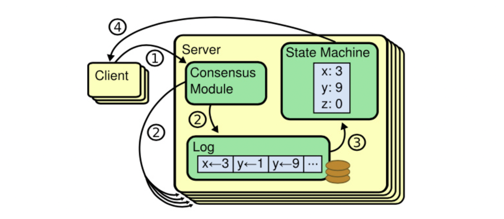

前面客户端的逻辑比较简单，接下来我们专注于分布式 KV 的服务端的处理，也就是说当客户端的请求发送过来之后，我们的后端的分布式 kv server 应该怎样处理这个请求。


按照我们前面梳理的大致交互逻辑，客户端的请求到达之后，我们需要首先通过 raft 模块将其存储到 raft 日志中，回想一下我们在前面实现的 raft 库中，提供了一个 `Start` 入口方法，这个方法是 raft 接收外部请求的，我们会将请求通过这个方法传递过去。

```Go
func (rf *Raft) Start(command interface{}) (int, int, bool) {
   rf.mu.Lock()
   defer rf.mu.Unlock()

   if rf.role != Leader {
      return 0, 0, false
   }
   rf.log = append(rf.log, LogEntry{
      CommandValid: true,
      Command:      command,
      Term:         rf.currentTerm,
   })
   LOG(rf.me, rf.currentTerm, DLeader, "Leader accept log [%d]T%d", len(rf.log)-1, rf.currentTerm)
   rf.persistLocked()

   return len(rf.log) - 1, rf.currentTerm, true
}
```

`Start` 方法会返回当前的节点是不是 Leader，如果不是的话，我们需要向客户端反馈一个 `ErrWrongLeader` 错误，客户端获取到之后，发现此节点并不是 Leader，那么会挑选下一个节点重试请求。

当 raft 集群中的 Leader 节点处理了 Start 请求之后，它会向其他的 Follower 节点发送 `AppendEntries` 消息，将日志同步到其他的 Follower 节点，当大多数的节点都正常处理之后，Leader 会收到消息，然后更新自己的 `commitIndex`，然后将日志通过 applyCh 这个通道发送过去。



然后 kv server 收到 apply 消息之后，将命令应用到本地的状态机中，然后返回给客户端。

也就是说，我们客户端需要一直等待 raft 模块同步完成，并且 Leader 节点将操作应用到状态机之后，才会返回结果给客户端。

所以这里我们需要启动一个后台线程来执行 apply 任务，主要是从 applyCh 中接收来自 raft 的日志消息，处理完之后，将结果存储到一个 channel 中，这时候 Get/Put/Append 方法就能从这个 channel 中获取到结果，并返回给客户端。

```Go
type KVServer struct {
   mu      sync.Mutex
   me      int
   rf      *raft.Raft
   applyCh chan raft.ApplyMsg
   dead    int32 // set by Kill()

   maxraftstate int // snapshot if log grows this big

   // Your definitions here.
}
```