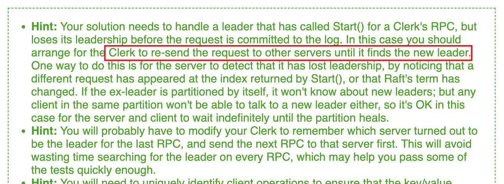
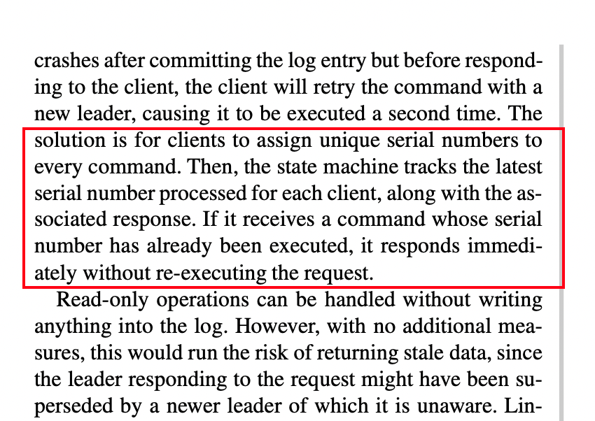
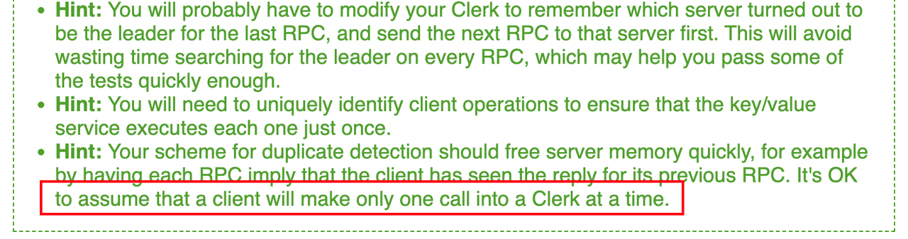

前面一节我们处理了 server 端的大致逻辑，我们知道 kv 服务是由多个 raft 节点组成的，而由于分布式系统中不可避免的节点故障等缘故，我们需要去处理这样的 failure 问题，这样才能够保证我们的分布式系统是始终可用、可靠的，即在大多数节点正常下依然能够正常响应请求，容忍少数节点发生各种未知错误。

例如，如果我们的客户端向集群中的 Leader 发送了一个请求，Leader 接收到请求之后，因为某种原因出现了故障，并且降级为 Follower，这时候客户端便一直等不到回复。直到客户端请求超时，那么它就会向下一个节点重试请求，直到正确得到了 Leader 的回应。



因此在客户端的 Clerk 代码中，如果节点发送故障，需要轮询下一个节点，重试客户端请求，直到得到了正确的响应，才结束请求。

```Go
func (ck *Clerk) Get(key string) string {
   // You will have to modify this function.
   args := GetArgs{
      Key: key,
   }

   var reply GetReply
   for {
      ok := ck.servers[ck.leaderId].Call("KVServer.Get", &args, &reply)
      if !ok || reply.Err == ErrWrongLeader || reply.Err == ErrTimeout {
         // 请求失败，选择另一个节点重试
         ck.leaderId = (ck.leaderId + 1) % len(ck.servers)
         continue
      }
      // 调用成功，返回 value
      return reply.Value
   }
}
```

**重复请求问题**

试想这样一个场景：分布式 KV 有一个客户端，先执行了 Put(x, 1) 请求，将 x 的值设置为 1，接着又执行了 Put(x，2)，将 x 的值设置为了 2。如果 Put(x, 1) 在执行的过程中，对应的节点发生了故障，那么它会重试请求，又将 x 的设置为了 1，那么这便违背了线性一致性。

```Go
   Client               Client
-------------      ---------------
  Put(x, 1)               |
     |                 Put(x, 2)
     |                    |
    失败                  成功
     |                    |
    重试                  
     |
  Put(x, 1)     
```

线性一致性要求每个客户端的请求应该立即被执行，并且只被执行一次，对于重试的请求，我们应该如何避免其被执行多次呢？

其实在 raft 论文中已经给出了相应的阐释以及解决方案：



一个非常直观的解决办法就是我们给客户端的每个命令赋予一个唯一的标识，当命令执行完之后，将命令标识和执行的结果保存到状态机中的一个 map 里面。每次请求的时候，我们首先从这个 map 中根据唯一标识获取是否存在这个命令，如果存在的话，则说明已经执行过了，则直接返回保存的结果，而不用再发送到 raft 模块进行同步。

只不过这样做有一个重要的前提，那就是客户端默认在同一个时刻只会有一个命令，即一个 Clerk 内部是不会有并发的请求的，这显然是合理的。



还需要注意的一个细节是，我们需要将每个命令都存储到去重的 map 中吗？显然不是，一个客户端只会重试当前最新的这个命令，对于已经成功执行的命令就没必要重试了，因此我们的去重 map 只需要为每一个客户端存储一个当前最新的命令即可。

## 参考链接

https://pdos.csail.mit.edu/6.824/labs/lab-kvraft.html

https://pdos.csail.mit.edu/6.824/notes/l-raft-QA.txt