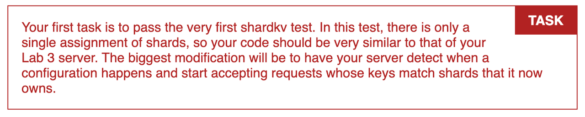

前面几节我们主要实现了分片分布式 KV 中的第一个重要的组成部分，那就是 shard controller，并且实现了获取和更改配置的接口。

接下来我们就需要回归到 shardkv 的具体逻辑了，这里贴一下我们的整体架构图，简单回顾一下：

我们的 shardkv 是由多个 Replica Group 组成的，每个 Replica Group 又是由一个 raft 集群组成，使用 raft 共识算法保证数据的一致性。每个 Group 都负责了一部分 shard 的读写请求，全部的 Group 组合到一起，就是一个完整的 shardkv 服务。

Shardctrler 负责存储配置信息，主要是 shard 到 Group 的分配关系，当配置发生变化的时候，Group 应该根据配置处理 shard，并且这里需要保证在处理配置变更时，客户端不能看到不一致的结果。

客户端会通过 Get、Put、Append 这三个方法来访问 shardkv，需要保证 Put 成功之后的结果对于后续的请求是可见的，即使 Put 请求和配置变更同时发生。

首先我们可以处理一种最简单的情况，即集群中只有一个 Group 的情况。

在官方 Lab4 的提示中其实也说明了，单个 Group 的逻辑和我们在 Lab3 实现的分布式 KV 基本上是一样的，因为每个 shard 都在这个 Group 中，并不会涉及到 shard 的负载均衡。

所以我们可以直接参考 Lab3 的代码，实现最简单的一个版本，只不过这里我们需要修改一些逻辑，服务端需要判断 key 所属的 shard 是否在对应的 Group 中，如果不是的话则返回一个 ErrWrongGroup 错误。Clerk 中如果拿到了这个 `ErrWrongGroup` 这个错误，需要重新从 shardctrler 获取配置，然后重试请求。

**参考链接**

https://pdos.csail.mit.edu/6.824/labs/lab-shard.html

