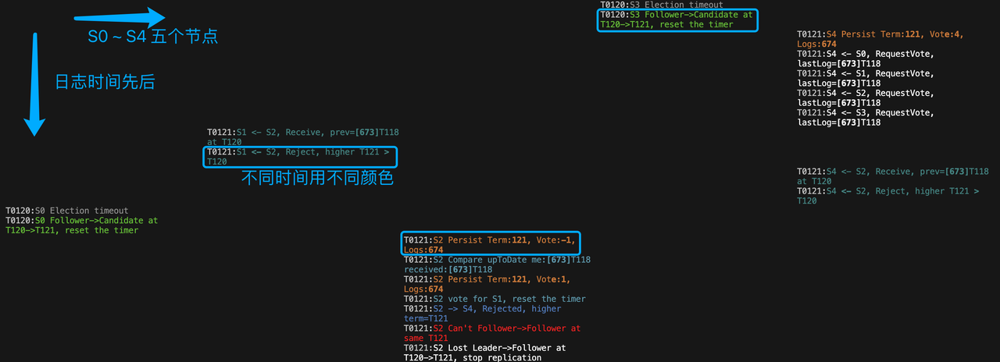
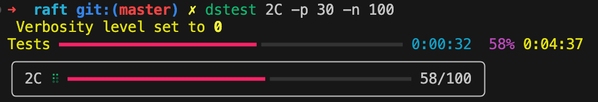

在分布式系统中进行调试本就是一个难点，而本实验无疑让这一点更加困难：

1. **多机日志混杂**。用单机模拟的分布式系统，将所有节点的日志汇聚到了一块，无疑加大了根据日志进行问题定位的难度。
2. **网络环境复杂**。为了在较短时间测出各种边角情况，本实验的测试通过（使用 labrpc 进行 mock）接管 RPC 层，将真实环境中**频次很低**的网络故障（RPC 消息**乱序**到达或者干脆**丢失**）大大提高。这让日志中的时间线非常难以追踪，进而定位各种事情发生的因果关系。

实验所需的 Raft 的代码并不算太多，最终大家花在调试（Debug）的时间要远比编码的时间要多，当然在真实工作中也是如此。因此，一个科学的调试方法就显的非常重要，他能大大加快你定位问题的速度。甚而，一个好的调试方法能让枯燥的调试过程变成充满趣味性的通关过程。

下面主要参考 [Debugging by Pretty Printing](https://blog.josejg.com/debugging-pretty/) 一文和我的一些经验，来介绍一种针对本实验多节点日志混杂、RPC 通信多变的情况的调试技术。

# 基本原理

对于编程调试，我们最常用的方法有两种：**借助工具单步执行**和**手动埋点分析**。但无论是多线程还是分布式编程，使用（类似的 gdb）工具进行单步调试都非常困难——程序的工作流太多了。此外，对于 Raft 这种逻辑正确严重依赖超时的代码来说，单步调试更加困难——会造成线程停顿，使得调试本身影响程序的正确性。

因此只剩下了手动埋点进行分析了，通俗来说，最常用的就是**打日志**。其他常见的埋点手段包括通过 http 等接口暴露一些运行时的各种信息，比如 [Prometheus](https://prometheus.io/) 监控，这里就不再展开了。

如果做过数据可视化等相关工作，就会有一个感觉：多维的图形信息要比单一的文本流更加直观。因此我们的目标是：**将一维的日志信息，尽可能地进行多维呈现**。在**命令行环境中**（不然还得自己做图形界面，就太复杂了）我们可以利用的维度有：

1. 纵向
2. 横向
3. 颜色

然后我们选取日志中我们最关心的三个因素，对齐到这三个维度即可：

1. 纵向：表时间先后，和普通日志一样，越到下面日志越新。
2. 横向：表节点不同，每个节点一列。
3. 颜色：表事件各异，每种事件一种颜色，如领导选举、日志同步、持久化等等。



# 实现细节

利用上述思想，使用日志手段进行调试实际上被分成了两个阶段：

1. 划分事件（event）模块，然后在合适的地方输出日志。
2. 将代码运行中产生的一维日志处理成多维呈现。

前者需要改造 lab 中的日志输出，后者需要编写一个小工具。

## 输出日志

在输出日志时，通常会有几个需求：

1. 划分日志时间模块
2. 控制日志输出详尽级别

### 模块划分

即对日志按事件种类划分模块。这件事没有一个固定标准，看每个人的偏好，且如果在调试时发现不直观及时调整即可，这里我给一个大致的方法。

从大类上来说，我们可以按级别将日志分为**四大类**：DEBUG, INFO，WARN，ERROR。重要程度依次递增：

1. DEBUG：覆盖**大部分事件**的调试信息，任何可能会关心的数据结构变化和事件发生都可以输出。比如 rpc 发送前打印、收到后打印，数量比较大，可能会影响性能，一般我们不打开。
2. INFO：**关键事件**的信息，比如 term 变更、发起选举、更新 matchIndex、更新 commitIndex 等等。
3. WARN：**异常行为**的信息，但不影响程序的正确运行。比如，RPC 没有收到。
4. ERROR：影响程序**正确运行**的信息。比如发现某个 Term 选出了两个 Leader。

然后为了方便调试，我们将 INFO 继续细分为几个重要模块：

1. Vote：谁投票给谁，谁拒绝谁的投票
2. Log：发送日志方
3. Log2：接受日志方
4. Term：Term 发生变更
5. Persist：对 Raft 字段持久化
6. Drop：删除 Log 日志
7. Commit：提交日志

等等，你可以根据自己偏好进行调整。

```Go
const (
    DError logTopic = "ERRO" // level = 3
    DWarn  logTopic = "WARN" // level = 2
    DInfo  logTopic = "INFO" // level = 1
    DDebug logTopic = "DBUG" // level = 0

    // level = 1
    DClient  logTopic = "CLNT"
    DCommit  logTopic = "CMIT"
    DDrop    logTopic = "DROP"
    DLeader  logTopic = "LEAD"
    DLog     logTopic = "LOG1" // sending log
    DLog2    logTopic = "LOG2" // receiving log
    DPersist logTopic = "PERS"
    DSnap    logTopic = "SNAP"
    DTerm    logTopic = "TERM"
    DTest    logTopic = "TEST"
    DTimer   logTopic = "TIMR"
    DTrace   logTopic = "TRCE"
    DVote    logTopic = "VOTE"
    DApply   logTopic = "APLY"
)
```

### 级别控制

我们按上面提到的分类，将日志本身分为四个级别：Debug，Info，Warn 和 Error，按重要程度，日志级别依次递增。

```Go
func getTopicLevel(topic logTopic) int {
    switch topic {
    case DError:
        return 3
    case DWarn:
        return 2
    case DInfo:
        return 1
    case DDebug:
        return 0
    default:
        return 1
    }
}
```

所谓对日志级别进行控制，就是在程序执行前可以动态的设置日志级别，而在运行前将级别参数传入 Raft 进程，通常有**命令行参数**和**环境参数**两种。这里使用环境参数，简单一些。

```Go
func getEnvLevel() int {
    v := os.Getenv("VERBOSE")
    level := getTopicLevel(DError) + 1
    if v != "" {
        var err error
        level, err = strconv.Atoi(v)
        if err != nil {
            log.Fatalf("Invalid verbosity %v", v)
        }
    }
    return level
}

// set env when run test
// VERBOSE=1 go test -run 2A
```

每条日志本身的级别我们称为 `topicLevel`，进行控制的传入级别我们称为 `logLevel`。我们将 `logLevel` 作为一个**低水位线**，输出所有高于此 `logLevel` 的日志。当然，也可以将 `logLevel` 作为高水位线，这取决于你的习惯。

```Go
topicLevel := getTopicLevel(topic)
if logLevel <= topicLevel {
    // print the log
}
```

## 格式细节

首先要在日志前缀输出我们在多维呈现的地方提到的几个关心的维度（时间、空间、模块）：time、term、peerId、和 topic，用空格分开，并保证对齐，方便后续对日志进行升维处理。这些维度数据本质上是这条日志的**元信息**，或者叫**日志头**。

当然，三个维度中我们没有提到 term，但我在跟踪日志的时候发现他也是一个非常重要的信息，所以就放在元信息里了。

```Go
func LOG(peerId int, term int, topic logTopic, format string, a ...interface{}) {
    topicLevel := getTopicLevel(topic)
    if logLevel <= topicLevel {
        time := time.Since(logStart).Microseconds()
        time /= 100
        prefix := fmt.Sprintf("%06d T%04d %v S%d ", time, term, string(topic), peerId)
        format = prefix + format
        log.Printf(format, a...)
    }
}
```

这里需要解释下，Golang 自带的日志 time 格式太长了：

```Go
fmt.Sprintf("%v", time.Now())
// 2023-08-18 09:55:31.930155 +0800 CST m=+1.118178251
```

但其实在 Raft 中我们并不关心这么多信息，我们只关心单次测试的时间线。因此借鉴 Unix 时间戳的思想，将程序运行时 `logStart` 作为计时起点，然后输出打印日志时间点和起始时间点 `logStart`的差值 `time.Since(logStart).Microseconds()` 即可。当然，由于我们使用 log 进行日志输出，需要通过设置标记位把默认的 date 和 time 信息关掉。这里的输出精度是 10 us，你可以按自己喜好进行调整。

```Go
func init() {
    logLevel = getEnvLevel()
    logStart = time.Now()

    // do not print verbose date
    log.SetFlags(log.Flags() &^ (log.Ldate | log.Ltime))
}
```

在元信息之外，每一条日志具体要输出什么样的内容呢？

每个人都有自己的偏好，这里提一条原则：在日志中输出**尽可能多**，但**尽可能简洁**的信息。尽可能多的信息好理解，毕竟信息多了才方便追踪因果逻辑。但为什么要尽可能简洁呢？因为 Raft 运行时会输出非常多的日志，如果不保持每条日志的简洁，我们很容易被日志洪流所淹没。

下面是我总结的保持日志简洁的一些小技巧：

1. **保持格式大体一致**。
    1. 结构一致：日志头、日志主语、事件描述、数据结构输出
    2. 格式一致：首字母大小写、Term 带前缀 T、 Server 带前缀 S、Term 和 Index 同时出现 Index 用中括号括起来等等。
2. **描述只保留关键字**。所有不必要谓词、介词、修饰语等等没有信息含量的单词都去掉。
3. **合理使用箭头符号**。使用箭头符号来简洁的表示 `RequestVote` 和 `AppendEntries` 等事件控制流向，总是
    1. Candidate -> Other Peer
    2. Leader -> Other Peer

```Go
003075 T0002 PERS S2 Persist Term:2, Vote:2, Logs:2
004078 T0002 LOG2 S0 <- S2, Receive, prev=[0]T0 at T2
004079 T0002 PERS S0 Persist Term:2, Vote:2, Logs:2
004079 T0002 LOG2 S0 <- S2, Accept log, (0, 1]
004079 T0002 TIMR S0 Accept log, reset timer
004078 T0002 LOG2 S1 <- S2, Receive, prev=[0]T0 at T2
004079 T0002 PERS S1 Persist Term:2, Vote:2, Logs:2
004079 T0002 LOG2 S1 <- S2, Accept log, (0, 1]
004079 T0002 TIMR S1 Accept log, reset timer
004079 T0002 LOG1 S2 -> S0, Accept, update matchIndex=[1 0 1]
004079 T0002 LOG1 S2 Update commitIndex: 0->1 actively
004079 T0002 APLY S2 Apply log as Leader, idx=[1, 1]
004079 T0002 LOG1 S2 -> S1, Accept, update matchIndex=[1 1 1]
005289 T0002 LOG2 S0 <- S2, Receive, prev=[1]T2 at T2
005290 T0002 PERS S0 Persist Term:2, Vote:2, Logs:2
005290 T0002 LOG2 S0 <- S2, Accept log, (1, 1]
```

上述日志是我随意截取的一段日志，加黑部分是日志头，可以看出对于变长字段（比如 Time、Term）都用 0 进行补齐了。

S0 代表 Server-0，也可以根据你的喜好称为 P0，Peer0。比较取巧（ tricky ）的一点是，我们把主语部分放到了日志头最后，这样就可以拼接后面的箭头和谓语头（下面高亮部分）：

```Go
004079 T0002 LOG1 S2 -> S1, Accept, update matchIndex=[1 1 1]
```

# 升维工具

虽然使用 shell 脚本也可以对生成的日志进行处理，但是相比 shell ，Python 的语法和生态无疑要强大的多。这里主要采用[该脚本](https://gist.github.com/JJGO/e64c0e8aedb5d464b5f79d3b12197338)。基本思想是：

1. 提取日志头中的元信息
2. 将不同 Server 的日志打印到不同列（借助 [rich](https://github.com/Textualize/rich) 库）
3. 做颜色映射表，将不同 Topic 的日志用不同颜色进行打印（借助 [rich](https://github.com/Textualize/rich) 库）
4. 提供一些简单的命令行参数指定 Server 数量、按 Topic 过滤、控制日志级别等等（借助 [typer](https://github.com/tiangolo/typer) 库）。

使用命令：

```Go
VERBOSE=1 go test -run TestBasicAgree2B | dslogs -c 3 -i PERS
```

`-c 3` 表示有个三个 server，`-i PERS` 表示过滤（ignore）掉 Persist 的输出。


我们可以根据我们的需要，对脚本做一些定制。比如我在日志头里新增了 Term，就要加入相应的解析：

```Go
 time, term, topic, *msg = line.strip().split(" ")
```

对于有些测试，比如 `TestFigure8Unreliable2C` ，需要高并发、运行很多遍才有可能触发失败，而我们只关心失败时候的日志，因此还需要一个小工具来做这件事情：

1. **指定运行并发数**。提高并发有两个好处，一来加速测试效率，二来提高出错可能。
2. **多次运行，记录出错时日志**。正确跑完的日志我们是不关心的。

这里采用与上述同一助教的该[脚本](https://gist.github.com/JJGO/0d73540ef7cc2f066cb535156b7cbdab)。虽然也可以用 Shell，但用 Python 可以做出更友好的界面和控制流程。比如，我们用 30 个并发将 lab 2C 跑一百次：



# 分析思路

在实际对出错日志进行分析的时候，我们可以使用一些技巧：

1. 确定某个 Term 是谁先开启的
2. 注意某些 RPC 是否乱序到达了
3. 确定某个 server 有问题时，可以通过 `grep S1 output.log | dslog -c 5` 等方式，专门过滤出和该 server 相关的所有日志。

# 参考

1. Debugging by Pretty Printing：https://blog.josejg.com/debugging-pretty/